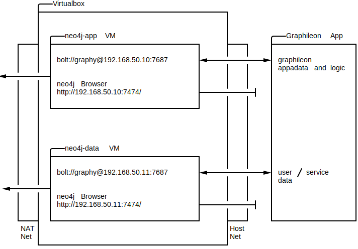

# Graphileon - Neo4j
Simple vagrant based setup with two neo4j instances (neo4j-app and neo4j-data) to run Graphileon.

The purpose of the two instances are as follows:
- neo4j-app -- GraphDB for Graphileon App data
- neo4j-data -- GraphDB Store for data (in this case itsm storage)

Because we currently only have a personal edition license (a.k.a. free) of Graphileon and this edition is intended for single-user use.

## Requirements
You need to have Virtualbox and Vagrant installed on your machine and that's it.

## Networking

### Diagram
Simple network diagram showing open ports and connection endpoints in each vm.


The `virtual machines` have two NICs and are dual homed (this requires first time Admin rights with virtualbox to setup the host only network).

- Subnet 1
  - Type: **Host Only network**
  - Net ID: 192.168.50.0/24

- Subnet 2
  - Type: **NAT**

## VMs
### VM: neo4j-app
- IP Address: 192.168.50.10
- Open Ports: 7474/tcp (neo4j Webfrontend), 7687/tcp (neo4j bolt Port)
- Services
  - Neo4j Frontend: http://192.168.50.10:7474
  - Neo4j bold: bolt://192.168.50.10:7686

### VM: neo4j-data
- IP Address: 192.168.50.11
- Open Ports: 7474/tcp (neo4j Webfrontend), 7687/tcp (neo4j bolt Port)
- Services
  - Neo4j Frontend: http://192.168.50.11:7474
  - Neo4j bold: bolt://192.168.50.11:7686

## Configuration
You can customize the installation by changing settings in the `Vagrantfile`.

- `GRAPHILEONFILE` - filename of debian package for graphileon. If this is set and a graphileon host is defined, vagrant will push this file into the host for installation.
- `NEO4JADMINPASS` - Variable that stores the password of the neo4j user.
- `GRAPHYNEO4JPASS` - Variable that stores the password for the additional graphy user (which also has admin rights on the neo4j db).

You can expand the number of hosts created, by changing the `HOSTS` list:
```ruby
HOSTS = {
   # VM Name      # Net based on Network
   "neo4j-app" => [NETWORK+"10", RAM, GUI, BOX],
   "neo4j-data" => [NETWORK+"11", RAM, GUI, BOX]
}
```
**IMPORTANT**
If you want to test out a Graphileon VM, please save the graphileon .deb file in `.provisioning` and add a new HOST to the HOSTS list with the name "graphileon".

### Default Users and Passwords
neo4j database (can be changed in the Vagrantfile):
- username: neo4j, password: marc, permissions: admin
- username: graphy, password: graphy, permissions: admin

operating system:
- username: vagrant, password: vagrant

## Important note
This is just a playground and by design not very secure (a.k.a. passwords in plaintext in source controlled files, no transport encryption or encryption at rest and only one user at the OS level - vagrant).

This setup is only for testing purposes.

# Contact
For any problems and or hints, please contact me through github or raise a issue directly.

# LICENSE
MIT License
